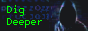
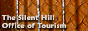

{}
<h2>
  My button
  {{% image src="heart.png" alt="icon" width="32" height="32"
  style="float:right; transform: translateY(-10%); margin-right: 12px; margin-left: -100%; border: 0; image-rendering: pixelated;" %}}
</h2>

Here are the crudely drawn buttons which you can add to your website if you feel like it.  
Let me know via e-mail if you added them to your site! ヾ(•ω•`)o  

  
  

{}

{}
<h2>
  Other sites
  {{% image src="person.png" alt="icon" width="32" height="32"
  style="float:right; transform: translateY(-10%); margin-right: 12px; margin-left: -100%; border: 0; image-rendering: pixelated;" %}}
</h2>

Here are other *personal* sites of people, which don't have a specific theme, therefore they are not located in the [cool links](/links) section of the site.  
They might be an inspiration or otherwise just cool blogs that I have a fun time visiting.  
  

  
  
  
  
  
  

  
The alive part of the internet is very hard to find. Therefore, I strongly recommend using the [Wiby search engine](https://wiby.me/) and [Neocities](https://neocities.org/) if you wish to find more cool sites easily missable by using any other search engine or resource.  
{}